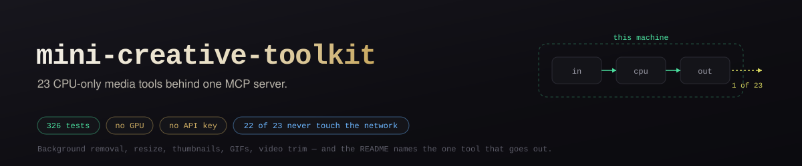

# 🧰 mini-creative-toolkit

Local, CPU-only image/video utilities exposed as an MCP (Model Context Protocol) server. No API keys, no GPU, no paid dependency — everything runs on-device.

Built as the deterministic complement to [nvidia-nim-mcp](../cosmos-video): generative work (image gen, LLM, upscaling) goes to that free-tier hosted server; simple, mechanical operations (background removal, resize, thumbnails, gifs) run right here, instantly, with nothing to sign up for.

## 🧰 Tools

| Tool | Does |
|---|---|
| ✨ `generate_image_free` | Text-to-image via [Pollinations.ai](https://pollinations.ai) — genuinely free, no signup or API key |
| 🖼️ `remove_background` | Cuts out the subject, transparent PNG (ONNX via `rembg`, CPU-only) |
| 📐 `resize_image` | High-quality Lanczos resize/fit |
| 🔄 `convert_format` | PNG ⇄ JPG ⇄ WebP |
| 🎬 `video_thumbnail` | Grab a single frame from a video |
| 🎞️ `video_to_gif` | Clip → optimized GIF (two-pass palette) |
| ✂️ `video_trim` | Fast lossless cut (falls back to re-encode if needed) |
| 🔍 `upscale_image` | Real-ESRGAN via Vulkan, reusing Upscayl's bundled binary/models — see limitation below |

## ⚠️ Known limitation

`upscale_image` is real and correct, but was tested on this machine's Intel UHD (integrated, no discrete GPU) and confirmed impractically slow — a single small icon didn't finish in 7+ minutes (32% progress). Vulkan-based upscaling genuinely needs a discrete GPU to be usable interactively; on integrated graphics, `generate_image_free` is the practical choice instead.

## ⚙️ Setup

```bash
uv sync
```

Run the test suite (each tool tested end-to-end against real generated fixtures, no mocks):

```bash
uv run pytest
```

Register it as an MCP server (project or user scope):

```bash
claude mcp add --transport stdio mini-creative-toolkit -- uv run --project /path/to/this/repo toolkit.py
```

## 🧑‍💻 Why this exists

Most "AI creative studio" repos turn out to be thin UI wrappers around a paid third-party API (see: everything under `fal-ai-alternative`/`kling-ai` on GitHub). The genuinely free, no-signup work — cutting out a background, resizing, making a GIF from a clip — doesn't need a model at all, let alone someone else's paid one. This toolkit handles that slice locally and leaves the actual generative work to [nvidia-nim-mcp](../cosmos-video)'s free-tier hosted models.

## 📄 License

MIT
