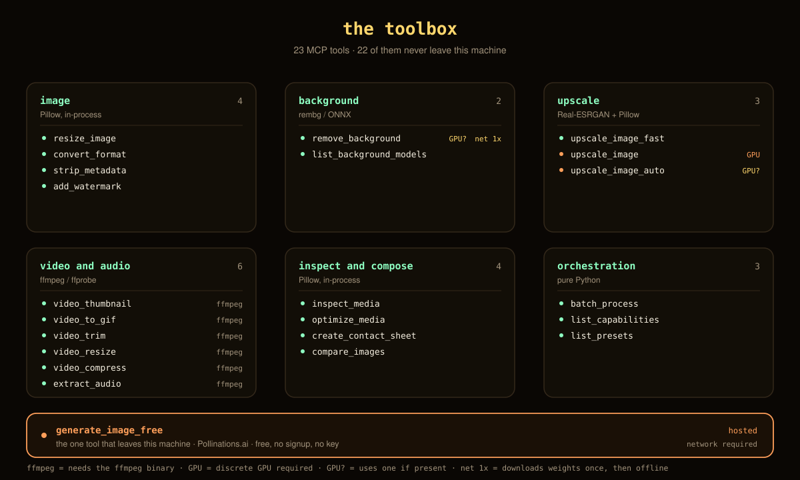
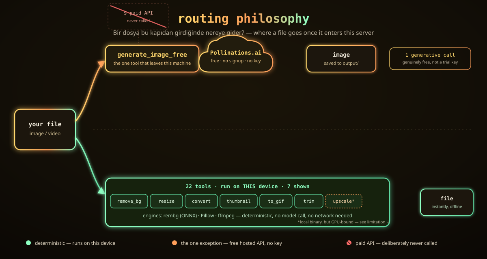
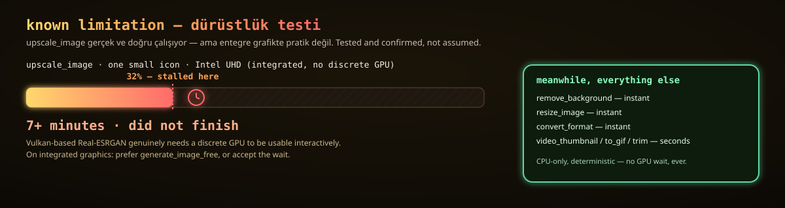

<p align="center">
  
  
  
  
  
  
</p>

<p align="center"><b>Local, CPU-only image/video utilities exposed as an MCP (Model Context Protocol) server.</b><br>No API keys, no GPU, no paid dependency — everything runs on-device, except the one tool that's honest about being a hosted call.</p>

---

## İçindekiler / Table of contents

- [Neden var — the pitch](#-neden-var--the-pitch)
- [The toolbox](#-the-toolbox)
- [Routing philosophy](#-routing-philosophy)
- [Known limitation — dürüstlük testi](#-known-limitation--dürüstlük-testi)
- [Setup](#️-setup)
- [Running the tests](#-running-the-tests)
- [Registering as an MCP server](#-registering-as-an-mcp-server)
- [Project layout](#-project-layout)
- [License](#-license)

---

## 🎯 Neden var — the pitch

GitHub'da onlarca "ücretsiz AI creative studio" reposu var — açıp bakınca hepsi aynı hikâye: kayıt ol, bir API key yapıştır, kredi kartı iste, sonra "ücretsiz" katmanın 10 isteklik olduğunu öğren. `fal-ai-alternative`, `kling-ai-wrapper`, `stable-diffusion-free-*` — hepsi ince bir arayüz, arkasında ücretli bir servis.

Bu repo tam tersi bir iddiada bulunuyor: **arka planı silmek, boyutlandırmak, formatı çevirmek, bir klipten GIF çıkarmak — bunların hiçbiri bir modele ihtiyaç duymuyor, bırakın başkasının ücretli modeline ihtiyaç duymayı.** Bu iş yerelde, CPU'da, anında biter.

| İddia edilen | Gerçek durum |
|---|---|
| "Ücretsiz AI studio" | Genelde ücretli API'ye ince bir kapı |
| Bu repo | 8 araç tamamen yerel (rembg/Pillow/ffmpeg/opencv) + 1 araç gerçekten ücretsiz hosted (Pollinations.ai) |
| API key gerekiyor mu? | Hayır — hiçbir araç için |
| Kredi kartı / hesap? | Hayır |
| Üretici (generative) model çağrısı? | Sadece `generate_image_free`, ve o da ücretsiz |

Deterministik işler yerelde kalır; tek üretici (generative) araç ücretsiz hosted bir API'ye gider ve **hiçbir zaman ücretli bir API'ye gitmez**. Bu, aşağıdaki [routing philosophy](#-routing-philosophy) bölümünde diyagramla anlatılıyor.

---

## 🧰 The toolbox



| Tool | Engine | Does | Where it runs |
|---|---|---|---|
| ✨ `generate_image_free` | [Pollinations.ai](https://pollinations.ai) | Text → image, genuinely free, no signup or API key | hosted (free) |
| 🖼️ `remove_background` | `rembg` (ONNX) | Cuts out the subject → transparent PNG | local, CPU |
| 📐 `resize_image` | Pillow | High-quality Lanczos resize/fit | local, CPU |
| 🔄 `convert_format` | Pillow | PNG ⇄ JPG ⇄ WebP, flattens alpha for JPEG | local, CPU |
| 🎬 `video_thumbnail` | ffmpeg | Grabs a single frame from a video | local, CPU |
| 🎞️ `video_to_gif` | ffmpeg | Clip → optimized GIF (two-pass palette) | local, CPU |
| ✂️ `video_trim` | ffmpeg | Fast lossless cut, re-encode fallback if needed | local, CPU |
| 🔍 `upscale_image` | Real-ESRGAN via Vulkan (Upscayl's bundled binary) | Upscales an image | local, **GPU-bound** — see [limitation](#-known-limitation--dürüstlük-testi) |
| ⚡ `upscale_image_fast` | FSRCNN (OpenCV `dnn_superres`) | Upscales an image, CPU-only, sub-second | local, CPU |

Every tool takes a file path in, returns a file path out (`output/` inside the repo, timestamped). No hidden state, no queue, no polling.

---

## 🧭 Routing philosophy



Bu projenin gerçek fikri burada: bir dosya geldiğinde, **ne kadarının gerçekten bir modele ihtiyacı var?** Cevap: neredeyse hiçbiri.

- **8 araç** — `remove_background`, `resize_image`, `convert_format`, `video_thumbnail`, `video_to_gif`, `video_trim`, `upscale_image`, `upscale_image_fast` — bu makinede, CPU üzerinde, deterministik olarak çalışır. `rembg`, `Pillow`, `ffmpeg`, `opencv` — network gerektirmez (upscale_image'in Vulkan binary'si de yerel çalışır, sadece GPU'ya ihtiyaç duyar; upscale_image_fast zaten saf CPU).
- **1 araç** — `generate_image_free` — gerçekten üretici (generative) olduğu için tek başına hosted bir API'ye, Pollinations.ai'ye gider. Ücretsiz, key'siz, kayıtsız.
- **Hiçbir araç** ücretli bir API'ye gitmez. Bu bir tasarım kararı, bir eksiklik değil — bkz. [Neden var](#-neden-var--the-pitch).

Bu repo, ağır işi ([nvidia-nim-mcp](../cosmos-video)'nin ücretsiz katmanlı hosted modellerine) bırakan geniş bir kurulumun deterministik/mekanik tarafı olarak tasarlandı: üretim orada, temizlik/dönüştürme burada.

---

## ⚠️ Known limitation — dürüstlük testi



`upscale_image` **gerçek ve doğru çalışıyor** — Real-ESRGAN modelini Vulkan üzerinden, Upscayl'in bundled binary ve modellerini yeniden kullanarak çağırıyor. Ama bu makinede test edildi ve dürüstçe raporlanıyor:

> Intel UHD (entegre, ayrı/discrete GPU yok) üzerinde tek bir küçük ikon **7+ dakikada, %32 ilerlemede** bile bitmedi.

Vulkan tabanlı upscaling'in etkileşimli olarak kullanılabilir olması için gerçekten ayrı bir GPU gerekiyor. Entegre grafikte:

- **Pratik seçenek**: `upscale_image_fast` kullan — FSRCNN (OpenCV'nin `dnn_superres` modülü üzerinden, ~40KB'lık önceden eğitilmiş bir model), tamamen CPU'da, tipik olarak **saniyenin çok altında** çalışır. Real-ESRGAN'ın halüsinasyon kalitesinde detay/doku üretme yeteneği yok — ama düz Lanczos resize'dan (`resize_image`) belirgin şekilde daha keskin kenarlar üretiyor, gerçek bir süper-çözünürlük modeli. Araştırma ve karşılaştırma (Lanczos'a karşı kenar keskinliği, wall-clock süre) için bkz. bu araştırmanın notları.
- **Ya da**: `generate_image_free` kullan (hosted, saniyeler içinde, ama bu üretici bir model — orijinal görseli değil yeni bir görsel üretir).
- **Ya da**: bekle — `upscale_image` doğru sonucu üretiyor, sadece yavaş.

Bu sınır kasıtlı olarak gizlenmiyor veya yumuşatılmıyor: `toolkit.py` içindeki `upscale_image` docstring'i bunu birebir söylüyor, `PROJECT.md` bunu kapsam dışı bırakıyor, ve bu README onu ilk sayfada tutuyor. Şeffaflık burada bug değil, özellik.

`upscale_image_fast`'in FSRCNN ağırlıkları [Saafke/FSRCNN_Tensorflow](https://github.com/Saafke/FSRCNN_Tensorflow) reposundan alındı — OpenCV'nin kendi `dnn_superres` GSoC projesi kapsamında üretilen, OpenCV'nin resmi dokümantasyonunda da referans gösterilen ağırlıklar (Dong et al., ["Accelerating the Super-Resolution Convolutional Neural Network"](https://arxiv.org/abs/1608.00367)).

---

## ⚙️ Setup

```bash
uv sync
```

Bu, `rembg`, `Pillow`, `httpx`, `mcp[cli]`, `opencv-contrib-python` gibi tüm bağımlılıkları kurar. `ffmpeg`/`ffprobe` sistemde kurulu olmalı (PATH'te). `upscale_image` için ayrıca Upscayl'in bundled binary/modellerine ihtiyaç var (repo içinde `toolkit.py`'de yolu tanımlı). `upscale_image_fast` için gereken FSRCNN ağırlıkları (`models/FSRCNN_x{2,3,4}.pb`, toplam ~120KB) repo'ya dahil — ekstra kurulum gerekmiyor.

## ✅ Running the tests

Her araç, gerçek üretilmiş fixture'lara karşı uçtan uca test edilir — mock yok, gerçek görsel/video dosyaları üretilip işlenir:

```bash
uv run pytest
```

`test_toolkit.py` şunları doğrular: aspect-ratio korumalı/korumasız resize, boyut validasyonu, eksik dosya hataları, JPEG için alfa düzleştirme, `remove_background`'ın gerçekten RGBA ürettiği, `upscale_image_fast`'in doğru ölçekte çıktı ürettiği ve geçersiz scale/dosya değerlerini reddettiği, video thumbnail/GIF/trim'in beklenen çıktı ve süreleri, ve GIF üretiminin ara palet dosyasını temizlediği.

## 🔌 Registering as an MCP server

```bash
claude mcp add --transport stdio mini-creative-toolkit -- uv run --project /path/to/this/repo toolkit.py
```

Proje veya kullanıcı scope'unda kaydedilebilir. Kayıttan sonra 9 araç da (`generate_image_free`, `remove_background`, `resize_image`, `convert_format`, `video_thumbnail`, `video_to_gif`, `video_trim`, `upscale_image`, `upscale_image_fast`) doğrudan çağrılabilir hale gelir.

## 📁 Project layout

```
mini-creative-toolkit/
├── toolkit.py          # MCP server + all 9 tools
├── test_toolkit.py      # end-to-end tests, real fixtures, no mocks
├── PROJECT.md            # scope, stack, definition of done
├── models/
│   └── FSRCNN_x{2,3,4}.pb # pretrained weights for upscale_image_fast (~40KB each)
├── assets/
│   ├── banner.svg         # hero banner
│   ├── routing.svg        # local-vs-hosted routing diagram
│   ├── tools-grid.svg     # tool icon grid
│   └── limitation.svg     # upscale_image honesty panel
└── output/                # generated files land here (timestamped)
```

## 📄 License

MIT
